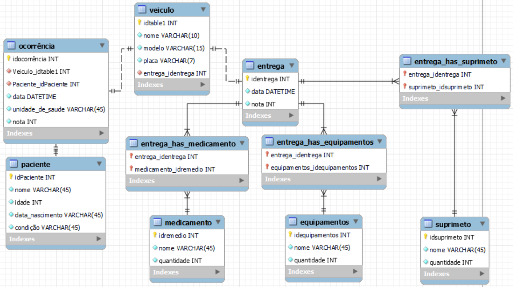
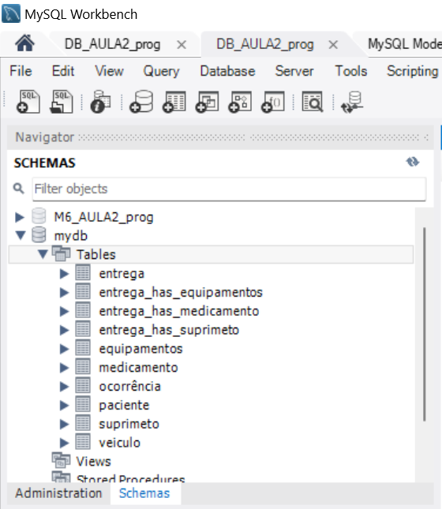
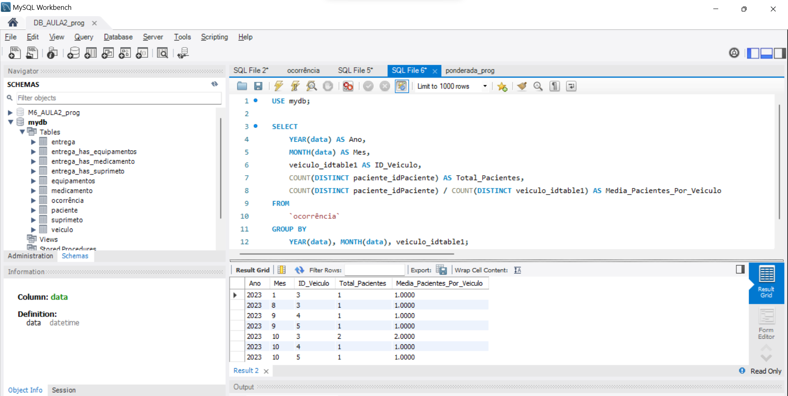

# Ponderada: Modelando dados e fazendo deploy em Nuvem

## Modelo lógico

Figura 1: Modelo lógico do banco de dados

## Criação do banco de dados

Figura 2: Banco de dados criado apartir do diagrama acima

## Query utilizada para calcular o número médio de pacientes transportados por veículo por mês

Figura 3: Query de consulta

## Endpoint do RDS
database-aula2-prog.c6wsoiddcqew.us-east-1.rds.amazonaws.com

